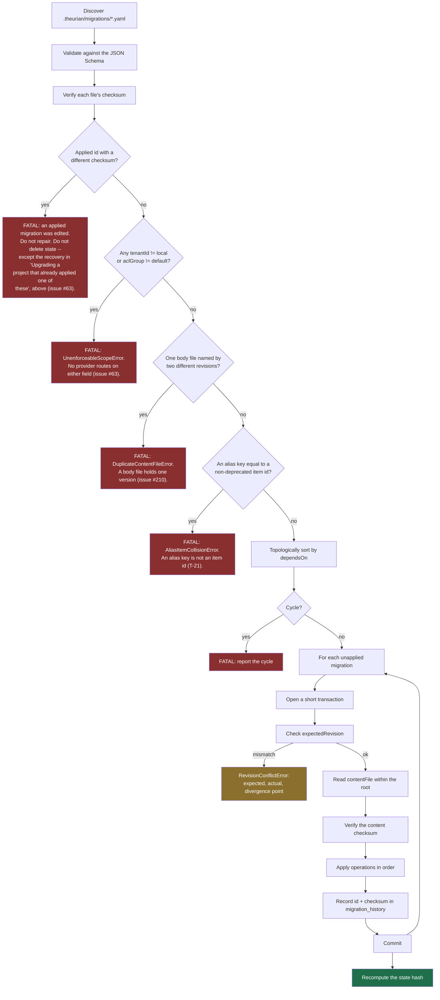

# Knowledge migration format

Normative schema:
[`schemas/migrations/migration.schema.json`](https://github.com/theurian/theurian/blob/main/schemas/migrations/migration.schema.json).
Decision record: [ADR-0005](../adr/0005-yaml-knowledge-migrations.md).

## Two migration systems, deliberately separate

| | Schema migration | **Knowledge migration** |
| :-- | :-- | :-- |
| Format | engine-native SQL | **YAML** |
| Changes | table structure of a derived store | **canonical knowledge state** |
| Lives in | `theurian/migrations/` (the package) | **`.theurian/migrations/`** (your repo) |
| Git-tracked as truth | no — the store is derived | **yes** |
| Reviewed by | Theurian maintainers | **your team** |

This page describes the second. They are separate because a structural change to
a rebuildable cache and an approval of an architecture decision are different
concerns, with different reviewers and different rollback semantics.

## Why YAML and not SQL

`UPDATE knowledge_items SET status='approved' WHERE item_id='...'` is
unreviewable as a statement about knowledge — a reviewer has to reconstruct
intent from a mutation. It also pins the log to one storage engine, and it cannot
express optimistic concurrency without hand-written guards in every statement.

An operation named `upsertRevision` with an `expectedRevision` reads as what it
is, replays into PostgreSQL or a document store as an adapter change, and carries
its concurrency guard in the format.

## Example

```yaml
apiVersion: theurian.dev/v1
id: 01K1DEFABC1234567890ABCDEF
createdAt: 2026-08-01T00:30:00+09:00
author: engineer@example.com
description: >
  Record the service-to-service authentication policy agreed in ADR-0009 and
  refined by the review on PR #431.
dependsOn:
  - 01K1ABCXYZ1234567890ABCDEF

operations:
  - op: upsertRevision
    itemId: architecture.auth-policy
    revisionId: 01K1DEFREV1234567890ABCDEF
    expectedRevision: 01K1ABCREV1234567890ABCDEF
    contentFile: ../knowledge/architecture/auth-policy.md
    contentSha256: 9a15842264396c898700b6bcfc7cc7d81f8dcaf617492b6c7c1001a3082d29c4
    metadata:
      title: Authentication and authorization policy
      contentType: text/markdown
      kind: architecture
      namespace: backend
      status: approved
      owner: platform-team
      trustLevel: reviewed
      sensitivity: internal
      scope:
        paths:
          - services/auth/**
```

Body content lives in a separate file rather than inline. Reviewers then read a
normal Markdown (or YAML, or JSON) diff, and the content hash covers the file's
actual bytes instead of a YAML-escaped copy of them.

The two guards on that operation cover two different things, and a hand-written
migration wants both: `expectedRevision` says which revision this one replaces
([Concurrency](#concurrency)), and `contentSha256` says which bytes the body
held when the migration was written
([Pinning the body](#pinning-the-body-contentsha256)). One body file backs one
revision — [a second revision naming it is refused](#one-body-file-one-revision-issue-210).

## Operations

The set is closed. Adding one is a protocol change and bumps `apiVersion`.

| Operation | Effect |
| :-- | :-- |
| `createItem` | Create an item with no revision yet |
| `upsertRevision` | Append an immutable revision and move the item pointer |
| `deprecateItem` | Mark deprecated, optionally naming a successor |
| `restoreItem` | Undo a deprecation |
| `addRelation` / `removeRelation` | Typed edges between items |
| `addAlias` / `removeAlias` | Keep a renamed item reachable by its old id |
| `changeSensitivity` | Reclassify. **Requires a reason.** |
| `changeOwner` | Transfer ownership |
| `registerSpecification` | Register a spec against a revision |
| `supersedeSpecification` | Point a spec at its replacement |
| `addEvidence` / `removeEvidence` | Attach or detach supporting artifacts |

`changeSensitivity` requires a `reason` because reclassification changes who may
read the content. It updates the canonical record and every live response at
once: a search reports the new label the instant the migration commits, because a
result reads the item's current sensitivity the way it already reads the item's
current status, not the immutable revision's. It does **not** force a full
rebuild.

It is not inert on the index either, and it stopped being so in
[#119](https://github.com/theurian/theurian/issues/119): every retriever now
filters on a chunk's and a node's sensitivity against the ceiling this deployment
declares, so a stale index row is no longer a label nothing reads. Three cases,
and only the middle one is a lag:

- **Past the ceiling the published build ran under** — the item is withdrawn from
  this deployment, and `migrate apply` purges its rows out of the published index
  in the same command, with no `index build` after it. The forest half is
  re-derived over the surviving rows, exactly as a `deprecateItem` already was
  (ADR-0024 decision 5, ADR-0025 part 2).
- **Within that ceiling** — nothing is withdrawn, so nothing is purged and no
  index file is copied. The chunk rows keep the label they were derived under
  until the next `index build`, and that lag reaches no reader: the label a caller
  sees is published from the item, and the gate the row must clear is applied
  against the item's current class as well.
- **Back down into that ceiling** — a purge copies a build and deletes from the
  copy, so an item the build was never allowed to write has no row to restore. It
  stays unserved until the next `index build` re-derives from canonical state,
  which fails toward *fewer* results.

Reclassification is still not a change anyone should be able to make without
saying why.

**Lowering an item's sensitivity is a hand-written `changeSensitivity`
migration and nothing else.** Write it under `.theurian/migrations/`, check it
with `theurian migrate validate`, and give the reason in the pull request as
well as in the operation. No proposal can lower a label the landed set holds
when the proposal is accepted. `theurian propose` refuses a draft that names a
lower class than an existing item's current one, and so does
`knowledge.proposeChange` for an item that exists and the caller may see;
`review.generateKnowledgeCandidate`'s `internal` gives way to such an item's
own class. Over MCP an item outside the caller's view is answered as an id
nothing created, so naming a lower class for it is not refused at draft, and
`theurian propose accept` is the floor that refuses the lowering.
`knowledge.generateMigrationDraft` does not carry `changeSensitivity` at all.
`theurian propose accept` refuses a proposal if replaying it with the landed set
would leave any existing item less sensitive than the landed set alone leaves
it, whichever operation in it moved the label, a `changeSensitivity` included.
That comparison is made at `accept` and not again: a `changeSensitivity` merged
after the acceptance, with a migration id that sorts before the proposal's,
replays first and is undone by the proposal's `sensitivity`, and
`theurian migrate validate` and `theurian migrate apply` report it as a
[permissive move](#permissive-moves-are-reported-not-refused) rather than
refuse it. A proposal that keeps or raises a label is accepted, provided the
landed set replays on its own, since the comparison needs the labels it leaves.
When it replays only together with the proposal — as when the proposal creates
an item that a landed `changeSensitivity` sorting after it reclassifies —
`accept` refuses and moves nothing. The refusal carries the replay engine's own
words: read what they name in `.theurian/migrations/` and make the set replay
on its own — `theurian migrate apply` runs the same replay; `theurian migrate
validate` still reports such a set valid, because its verdict does not rest on
a replay, and its `permissiveMovesUnavailable` says the set does not replay —
then accept again. A refused lowering names one step per cause:
`theurian migrate apply` if the served state lags the landed migrations, which
is how a draft made over MCP comes to carry a stale label; otherwise a new
draft that names the item's current sensitivity or omits it; and, to lower the
label, the hand-written `changeSensitivity`. It also says that once that
migration lands, the update is drafted again with `theurian propose` rather
than this proposal accepted again, because its migration id predates the
migration and replays before it
(`test_floor_refusal_remedy.py::test_every_remedy_that_sends_the_reader_to_a_migration_says_to_draft_again_not_accept_again`),
and to edit `dependsOn: [<its id>]` into the new draft's migration file
(`::test_every_remedy_that_says_to_draft_again_says_to_edit_dependson_in`). A
fresh draft declares no `dependsOn`, and its id need not sort after that
migration's: a migration declaring `dependsOn` replays after every one that
declares none, and a hand-chosen id, or one from a clock running ahead, sorts
after every draft. Only `dependsOn` places the new draft after it; without it
the draft can replay before that migration and be refused again.

**Readmitting a retired item is a hand-written `restoreItem` migration and
nothing else.** A retired item is one whose status is `deprecated`,
`superseded` or `rejected`, and no flag serves any of them. Write the
`restoreItem` under `.theurian/migrations/`, check it with
`theurian migrate validate`, and give the reason in the pull request. No
proposal can readmit an item the landed set holds retired when the proposal is
accepted: `theurian propose accept` refuses one, because its floor compares the
status the replay leaves, whatever operation moved it. The floor is needed
because an `upsertRevision` adopts `metadata.status`, and every drafted
revision says `approved`. `theurian propose` refuses to draft for a retired
item, in one message that names no status and a remedy naming the hand-written
`restoreItem`; `theurian okf import` refuses a concept for one too. Over MCP a
retired item is absent to the caller: `knowledge.proposeChange` and
`review.generateKnowledgeCandidate` answer it as they answer an id nothing
created, and `knowledge.generateMigrationDraft` does not carry `restoreItem` at
all. `theurian propose accept` refuses a proposal if replaying it with the
landed set would leave an item that the landed set alone leaves retired in a
status that is served — `approved`, `draft` or `proposed` — whichever operation
in it moved the status, a `restoreItem` included. That covers an update drafted
by a build without these checks, one edited by hand, one whose migration
replays after a landed deprecation that sorts before it, and an MCP draft for a
retired item that has no revision. That comparison too is made at `accept` and
not again: a `deprecateItem` merged after the acceptance, with a migration id
that sorts before the proposal's, replays first and is undone by the
proposal's `status: approved`, and `migrate validate` and `migrate apply`
report it as a [permissive move](#permissive-moves-are-reported-not-refused)
rather than refuse it. Moving `draft` or `proposed` to `approved` through a
proposal is not refused: both already reach a caller that asks for unapproved
items, so nothing is readmitted, and merging the proposal is the approval.
[ADR-0032](../adr/0032-the-write-intent-mcp-tool-surface.md)'s
GHSA-v2qg-23fc-7fqp amendment names the tests that hold this paragraph and the
one above.

### An `upsertRevision` re-labels the item

The item takes its `status`, `owner`, `kind`, `namespace`, `trustLevel` and
`sensitivity` from each revision an `upsertRevision` lands, on every update and
not only the first revision. `trustLevel` and `sensitivity` are optional in the
schema, and an omitted one loads as `unverified` and `internal` on an update
exactly as on a first revision. So a hand-written update that leaves
`sensitivity` out does not keep a `confidential` item `confidential`: it makes
it `internal`, and nothing in the diff says so. **A hand-written
`upsertRevision` restates every label the item should keep**, the in-place
status change [below](#one-body-file-one-revision-issue-210) included.

The loader does not inherit an omitted label from the item, and under
`theurian.dev/v1` it cannot start to. An applied migration is frozen and an
empty store replays every committed one, so a new meaning for an absent key
would change what already-applied documents do on their next replay: the
silent reinterpretation
[ADR-0038](../adr/0038-specification-folds-into-a-knowledge-kind.md) decision 5
rules out, and one
[ADR-0039](../adr/0039-closed-set-extension-compatibility.md) decision 6 does
not admit for an effect that reaches `sensitivity`.

`theurian propose`, `knowledge.proposeChange` and
`review.generateKnowledgeCandidate` write differently. For an item that
already exists — over MCP, one the caller may see — they fill each label the
caller left out with the item's current one and write it into the migration,
so the reviewer reads what the item will hold. That includes the first revision
of an item a `createItem` made and nothing has revised: it already holds labels,
which that revision would otherwise replace with the defaults. It still takes no
`expectedRevision`, because it has no revision to name. Any other item id has
nothing to keep: an unset `trustLevel` or `sensitivity` stays out of the file
and the loader's default applies, an unset `namespace` is the item id's own, and
`theurian propose` names the defaults it will publish.
`review.generateKnowledgeCandidate` sets `inferred` and `internal` for such an
id, and for an item the caller may see sets `inferred` and keeps the item's own
sensitivity.

## Engine guarantees

### Identity and immutability

- Migration ids and revision ids are ULIDs, so lexical order equals creation
  order.
- **An applied migration is frozen.** Same id, different checksum is a fatal
  error, never an auto-repair: the recorded history and the file now make
  different claims, and only a human can say which is right.

### Ordering

- `dependsOn` is topologically sorted.
- Cycles are rejected before any operation runs.
- A missing dependency is an error, not a skip.

### Concurrency

`expectedRevision` guards each item:

| Value | Meaning |
| :-- | :-- |
| absent | must be creating the item's first revision |
| matches current | apply |
| does not match | `RevisionConflictError` with expected, actual, and the divergence point |

Revision conflicts are **reported, never merged**. An automatic three-way merge
of a design decision produces a paragraph nobody approved — precisely the
failure Theurian exists to prevent. A withdrawal that an update's labels undo
is not a revision conflict, because `deprecateItem`, `changeSensitivity` and an
[in-place](#one-body-file-one-revision-issue-210) `upsertRevision` move no
revision; it is [reported as a permissive
move](#permissive-moves-are-reported-not-refused).

### Permissive moves are reported, not refused

`theurian propose accept` compares an item's labels once, against the
migrations landed at that moment. A withdrawal merged after an update was
accepted, with a migration id that sorts before the update's, replays first,
and the update's own `status` or `sensitivity` then replays over it. The
withdrawal is undone and the set still applies. Neither pull request's diff
shows the other, so neither merge approved the outcome. The withdrawal can be
an in-place `upsertRevision` re-declaring the current revision `rejected`,
`superseded` or `deprecated`, or at a higher class; a `deprecateItem`; or a
`changeSensitivity` that raises the class.
`test_permissive_move_report.py::test_an_update_accepted_after_a_withdrawal_that_sorts_first_is_reported_undoing_it`
builds the last two, a `deprecated` item that ends `approved` and a
`confidential` one that ends `internal`, and
`::test_an_in_place_withdrawal_by_upsert_is_what_an_accepted_update_is_reported_undoing`
the first, once for each of the three statuses and once raising `internal` to
`confidential`.

`theurian migrate validate` and `theurian migrate apply` name each such update
in `permissiveMoves`. It is a report, not a refusal: both commands exit 0 on
that race, as they did before the report existed, so a history that already
holds such an update keeps applying. With `--json` it is a list with one object
per loosened field:

| Key | Value |
| :-- | :-- |
| `migrationId` | the migration holding the `upsertRevision`; for `reorders`, the migration whose write it is |
| `itemId` | the item |
| `field` | `status` or `sensitivity` |
| `before` | the item's value at the start of that migration |
| `after` | the item's value at the end of that migration |
| `undoes` | the migration that, before that migration, last changed whether the item may surface (`status`) or its class (`sensitivity`); for `reorders`, the larger-id migration the field is attributed to |
| `kind` | `undoes` when that change tightened the field, whatever operation made it; `lowers` otherwise; `reorders` by the rule below |

`kind` is decided by the change's effect, not its operation, and judged by the
`accept` floors' own predicates: for `status`, whether
`may_surface(status, include_unapproved=True)` admits the item; for
`sensitivity`, its class by `DISCLOSURE_ORDER`. A write is a change only when it
changes that answer, and the change is a withdrawal when it tightened the field
— `status` to a value the predicate does not admit, or `sensitivity` raised — on
an item that existed when its migration began. So an in-place `upsertRevision`
to `rejected` is one
(`::test_an_in_place_withdrawal_by_upsert_is_what_an_accepted_update_is_reported_undoing`),
and a `changeSensitivity` that lowers the class is not
(`::test_a_declassification_is_not_a_withdrawal_so_a_further_lowering_is_reported_as_lowers`).
A `createItem` is never one
(`::test_a_create_item_is_never_a_withdrawal_so_a_later_lowering_is_reported_as_lowers`),
nor is a write in the migration that created the item: that is its first
labelling. A write between two retired statuses leaves the predicate as it
found it, so it is not a change and does not take the withdrawal's place in
`undoes`. After a `deprecateItem` then an in-place upsert to `rejected` or to
`superseded`, an in-place `rejected` then a `deprecateItem`, or a
`deprecateItem` and an in-place `superseded` in one migration, all sorting
before an accepted update, the update's row names the first write's migration,
`kind: undoes`
(`::test_a_retired_to_retired_write_does_not_displace_the_withdrawal_an_update_is_reported_undoing`);
nor does an upsert restating `deprecated` take the deprecation's place
(`::test_a_restated_status_does_not_replace_the_withdrawal_that_set_it`).
`DISCLOSURE_ORDER` is a total order, so every change of a `sensitivity` value is
a change of class: for that field the value and the predicate coincide.
`test_permissive_move_writer_property.py` holds the rule over every pair of
values, for a field that already has a recorded writer: of the 36 ordered pairs
of statuses, a second write replaces the first as the writer exactly when it
changes what `may_surface` answers, and is a withdrawal exactly when it
tightened it
(`::test_a_status_write_replaces_the_recorded_writer_only_by_changing_surfaceability`);
of the 16 of sensitivities, exactly when the value changes, and a withdrawal
exactly when it is raised
(`::test_a_sensitivity_write_replaces_the_recorded_writer_only_by_changing_the_class`).

`undoes` and `kind` are `null` together when this replay recorded no writer for
the field before that migration, because an earlier `apply` last set it
(`PermissiveMove`, in `application/permissive_moves.py`). With no writer to
keep, the rule above does not hold: a write that changes the value is recorded
even when the predicate does not move, as no withdrawal, so a readmission after
a write between two retired statuses reads `kind: lowers` naming that write.
That was measured on 2026-10-02 by feeding `LabelWriters` the two upserts
directly; no test drives either case. Without `--json` each row is one line,
measured on the `status` face on 2026-10-02:

```text
permissiveMoves:
  - 01M3WKMZ7J2GSWW5X2J304XH8B moves architecture.auth-policy status deprecated -> approved: undoes 01K1BBBBBB01234567890ABCDE
```

`lowers` is a loosening whose field was last changed by something other than a
withdrawal. An upsert that omits `sensitivity` takes the loader's `internal`,
which lowers the `confidential` its item's `createItem` set
(`test_permissive_move_report.py::test_an_upsert_omitting_sensitivity_lowers_what_the_create_item_set`), and
a hand-written upsert can name a lower class outright
(`::test_a_hand_authored_upsert_lowering_an_earlier_upserts_sensitivity_is_reported_as_lowers`,
whose item a `createItem` and an upsert stating `confidential` make in one
migration).

**What is reported.** Apart from `reorders` (below), a replayed
`upsertRevision` is reported for a field only when both of these hold:

1. the upsert itself loosened the field, against the item just before it;
2. its migration left the item looser than it found it, comparing the
   migration's end with its start.

"Looser" is the `accept` floors' own test. For `status`,
`may_surface(status, include_unapproved=True)` goes from false to true, so an
item moving from `draft` to `approved` is not a move
(`::test_a_first_revision_taking_a_draft_item_to_approved_reports_no_move`).
For `sensitivity`, the class is lower by `DISCLOSURE_ORDER`. The first clause
leaves out an upsert that loosened nothing itself: one restating the `approved`
a `restoreItem` earlier in its own migration set
(`::test_a_restore_and_content_update_in_one_migration_reports_no_move`), one
raising a class a `changeSensitivity` beside it had lowered
(`::test_an_upsert_raising_the_label_is_not_reported_after_the_migration_made_it_public`),
and the update a refused readmission's remedy now leads to, a fresh
`theurian propose` draft that replays after the `restoreItem` once it lands.
The remedy has that draft declare `dependsOn: [<restore>]`; the test holds a
draft without it, behind a restore that declares no `dependsOn` and sorts
before the draft
(`test_accept_refuses_a_reported_upsert.py::test_a_fresh_draft_after_the_restore_is_accepted_and_reports_nothing`).
That last holds only because `accept` refuses the other route, accepting the
refused proposal again: its migration id was minted at the draft, so it
replays before the restore, its upsert loosens the field itself, and it would
be reported (below). The second is the floors' granularity: a later operation
in the same migration decides the end
(`::test_a_deprecation_later_in_the_migration_decides_the_end_state_so_nothing_is_reported`,
with `::test_a_restore_after_a_later_deprecation_in_the_migration_leaves_the_readmission_reported`
as its control), and `after` is the value the migration ends on
(`::test_a_reported_after_is_the_value_the_migration_ends_on_not_the_one_the_upsert_wrote`).
An item absent at its migration's start is never compared, so labelling a new
item in the migration that creates it is not a move
(`::test_a_new_item_labelled_in_the_migration_that_creates_it_reports_no_move`).
Outside `reorders`, only upserts are reported: a `changeSensitivity` that lowers and a
`restoreItem` that readmits are the sanctioned operations, and neither is
(`::test_only_a_loosening_upsert_is_reported`).

One migration is one reviewed diff: a migration that withdraws and re-asserts an
item, or lowers and then restores it, is not reported. Its reviewer saw both
operations, and its end is no looser than its start
(`::test_a_migration_that_withdraws_and_reasserts_an_item_in_one_diff_is_not_reported`,
`::test_an_upsert_lowering_that_a_later_operation_restores_is_not_reported`).

**`reorders` (GHSA-wwq9-p8wq-5m68).** A migration declaring `dependsOn`
replays after every one declaring none, whatever the ids. So, before each
migration replays, each `status` and `sensitivity` is attributed to the
largest-id migration that has written it, by any label write, at the level it
left it; a smaller-id write never takes the
attribution, whatever its effect. A smaller-id migration that found the field
at or above that level and ends it below, by the floors' predicates, is a
`reorders` row whatever it wrote, `undoes` naming the attributed migration
(`test_reorders_report.py::test_validate_and_apply_report_the_dependson_migration_as_reordering_the_later_id`,
a `changeSensitivity` and a `restoreItem`;
`::test_a_lowering_after_a_tightening_replaying_after_an_accepted_raise_reports_a_real_loosening`,
a smaller-id raise that takes no attribution). It replaces an `undoes` or
`lowers` row for the same migration, item and field
(`::test_an_upsert_that_is_both_undoes_and_reordered_yields_one_reorders_row`,
an `undoes` one); a `dependsOn` deprecation after a larger-id `restoreItem`
tightens and is not reported (`::test_a_tightening_inversion_is_not_reported`).
Its line ends "replays after `<undoes>`, a larger id, and undoes it"
(`::test_the_text_report_names_the_migration_a_reorders_row_undoes`).
Its `after` is where its own migration left the field, and a further smaller-id
lowering that starts below the attributed level is not another `reorders` row
(`::test_a_second_lowering_that_starts_already_below_is_not_a_second_row`), so
read the item's current label, not `after`.

**`propose accept` never introduces or re-attributes a report row.** The
floors compare where the landed set ends with where the landed set and the
proposal end, so they
pass a proposal whose migration replays before a landed one that re-sets what
the proposal changed. The row the replay with the proposal then reports can
name either migration. It names the proposal's own when its upsert loosened
the field: a proposal refused as a readmission and accepted again after the
`restoreItem` its remedy asks for is one, since the restore sorts after it, so
both replays end with the item restored, but the upsert takes the item from
`deprecated` to `approved` before the restore does, and would be reported
`kind: undoes` for as long as the migration exists. It names a landed one when the proposal withdrew what a
landed upsert then loosens: a `deprecateItem` staged by
`knowledge.generateMigrationDraft`, whose migration id is minted then, and
accepted only after a content update drafted later has been accepted and
applied, replays before that update, whose `status: approved` undoes it; a
proposal's `changeSensitivity` raise is undone the same way by an update
restating the lower class. A proposal can also re-attribute a row the landed
set already reports, by replaying after the migration the row undoes and
before the row's own. An `internal` item raised to `confidential` by a landed migration that
sorts first, then restated `internal` by a landed update, reports the update
undoing that raise; a proposal raising the item to `restricted`, minted before
the update, turns the row into `restricted` to `internal` undoing the
proposal. A proposal that restores and then deprecates an item a landed
`deprecateItem` withdrew takes over the update's `deprecated` to `approved` row
the same way, its `before` and `after` unchanged. So `accept` compares the
report of the replay with the proposal with the report of the landed set alone,
both from replays it already runs, and refuses, with exit 1 and nothing moved,
a proposal whose replay reports any row the landed set alone does not, matched
on `migrationId`, `itemId`, `field` and `undoes`
(`application/permissive_moves.py :: introduced_moves`). `undoes` is in the
match, not `before`, because it is decided at the floors' granularity above:
the status case leaves `before` as it was, and a write between two retired
statuses moves `before` without changing what either gate answers. A row the
landed set already reports, naming the same migration as what it undoes, never
refuses: it is the history's, not this accept's, and the baseline, so a
proposal that leaves it as it is passes this check, though the end-state
refusal below can still refuse it. The
check runs after the two floors (`ProposalService.accept`), so a proposal they
refuse too gets their refusal.

**Nor may a landed migration leave what the proposal sets looser**.
After the report check (`ProposalService.accept`),
`accept` refuses, exit 1 and nothing moved, when the replay ends a `status` or
`sensitivity` the proposal wrote looser, by the floors' predicates, than the
proposal left it, whatever the landed operation and whatever rows the landed
set reports, and names the landed migration that last took it below that
level (`application/permissive_moves.py :: loosened_after`, from
`_refuse_a_landed_overwrite`). Its error says that migration would "loosen
what it sets", and its remedy is the redraft below, naming it in `dependsOn`.
That is the error for a loosening that adds or re-attributes no report row. One
that would add a row the landed migrations alone do not report, a `reorders`
row included, or would make a row the history already holds name a different
migration in `undoes`, is refused first by the report check above: for
instance, a smaller-id `dependsOn`
lowering replaying after the proposal's raise, with no id larger than the
proposal's having written the field
(`test_accept_refuses_a_replay_order_overwrite.py::test_accept_refuses_and_names_the_overwriting_migration_and_the_route`).
`::test_a_restatement_after_the_proposal_hides_no_later_loosening` refuses
where a landed restatement of the proposal's label is followed by a landed
`restoreItem` or `changeSensitivity` that loosens it, with both landed ids
smaller, and both larger, than the proposal's, and its error names the
loosening migration, in the report check's words and in this check's
respectively. Where a landed migration sets the field looser than the
proposal does and a later one sets it back to the proposal's value, a
`changeSensitivity` then another or a `restoreItem` then a `deprecateItem`,
`accept` passes with both landed ids larger than the proposal's
(`::test_a_larger_id_loosening_that_a_landed_migration_raises_back_is_accepted`)
and refuses the lowering's `reorders` row with both smaller
(`::test_a_smaller_id_loosening_that_a_landed_migration_raises_back_is_refused_for_its_row`).
As `theurian propose` writes the labels an update inherits (above), an honest
update minted before a landed, larger-id declassification restates the old
class and is refused too; its redraft, which inherits the lower class and
declares `dependsOn` on the declassification, is accepted
(`::test_a_content_update_minted_before_a_landed_larger_id_declassification_is_refused`).

For the proposal's own row, the error names the proposal's migration, the item,
the field, both values, and the landed migrations that replay after it and
write that field of that item, read from their operations: `upsertRevision` and
`createItem` write both labels, `deprecateItem` and `restoreItem` `status`, and
`changeSensitivity` `sensitivity`
(`application/proposal_service.py :: _refuse_a_reported_upsert`). For a landed
migration's row, the error reads "Accepting this proposal would make the landed
migration `<id>` move `<item>` `<field>` from `<before>` to `<after>`, undoing
what this proposal sets: this proposal's migration replays before it." For
either row, the remedy is a new migration that replays after the landed
migrations the error names, routed by every operation kind the refused
proposal carries (`_redraft_remedy`):

| Every kind the refused proposal carries is | The remedy, after "Nothing has moved." |
| :-- | :-- |
| `createItem` or `upsertRevision` | "Draft this change again with `theurian propose`, so it replays after `<id>` only through its `dependsOn`; edit `dependsOn: [<id>]` into the drafted migration file, as the command has no option for it." |
| one `knowledge.generateMigrationDraft` drafts | "Draft this change again with `knowledge.generateMigrationDraft`, so it replays after `<id>` only through its `dependsOn`, with `dependsOn: [<id>]` in its document." |
| otherwise | "Author the `<kinds>` operation as a migration that replays after `<id>` only through its `dependsOn`, declaring `dependsOn: [<id>]`, and apply it with `theurian migrate apply` once a human has reviewed it." |

Each ends "Then delete `<proposal dir>/`.", `<id>` is the landed migration or
migrations the error names, and `<kinds>` is every kind the proposal carries,
sorted and joined with " and ", and "operation" becomes "operations" for more
than one. A tool is named only when it drafts the whole proposal: the reader of
one that restores and then deprecates an item, told to author only its
`restoreItem`, would readmit an item the proposal meant to leave withdrawn.
Every route names `dependsOn`, whatever the landed migrations declare, because
no id order places a fresh draft after them. A fresh draft declaring no
`dependsOn` can replay before a landed migration, for instance one whose id
sorts after the drafting clock (a hand-chosen id, a staged id edited before
`accept`, or a collaborator's clock running ahead), and be refused again; a
migration declaring `dependsOn: [<id>]` replays after `<id>`. The floor
refusals' remedies say the same: once the `restoreItem` or `changeSensitivity`
they name lands, draft the update again rather than accept the refused proposal
again, since its migration id predates that migration, and edit
`dependsOn: [<its id>]` into the new draft's migration file.
`test_floor_refusal_remedy.py::test_every_remedy_that_sends_the_reader_to_a_migration_says_to_draft_again_not_accept_again`
builds the remedy for a lowering, for a readmission, for both on one item, and
for two lowerings of which one item is also readmitted, reads
`ACCEPT_LOWERING_REMEDY` itself, and asserts that each says
`theurian propose`, "rather than accepting" and "this proposal again".

`test_accept_never_introduces_a_report_row.py::test_a_withdrawals_remedy_routes_to_the_migration_draft_tool_not_the_content_path`
refuses a staged `deprecateItem` behind a landed update that declares no
`dependsOn`, and asserts a remedy naming `knowledge.generateMigrationDraft` and
`dependsOn: [<update>]`, and none of `theurian propose`, `proposeChange` or
"later migration id".
`::test_a_sensitivity_raises_remedy_routes_to_a_hand_authored_migration`
refuses a staged `changeSensitivity` raise and asserts a remedy holding
"author", `changeSensitivity` and "migration" in that order within one
sentence, and naming neither `theurian propose` nor `generateMigrationDraft`.
`::test_the_remedy_names_dependson_when_the_landed_update_declares_it` lands
the update with `dependsOn` and asserts a remedy naming `dependsOn` followed by
the update's migration id, and `knowledge.generateMigrationDraft`.
`::test_a_fresh_withdrawal_without_dependson_is_refused_again_behind_a_dependent_update`
is the loop that clause prevents: a fresh deprecation whose id sorts after the
update's is refused with exit 1 and an error naming the update.
`::test_a_fresh_withdrawal_that_depends_on_the_dependent_update_is_accepted_and_takes_effect`
follows the remedy: a deprecation drafted with `dependsOn` naming the update is
accepted with exit 0, and after `migrate apply` the item is `deprecated` and
the report empty. And
`::test_a_withdrawal_redrafted_behind_a_future_id_update_lands_with_dependson`
re-ids the update, before its accept, to one sorting after every draft, and
asserts that the stale deprecation's remedy names
`knowledge.generateMigrationDraft` and `dependsOn: [<update>]`; a fresh
deprecation drafted with that `dependsOn`, its id sorting before the update's,
is accepted with exit 0, and after `migrate apply` the item is `deprecated` and
the report empty. For the proposal's own row,
`test_accept_refuses_a_reported_upsert.py::test_the_own_row_remedy_keeps_the_content_path_for_an_upsert_and_never_says_accept_again`
asserts, behind a landed restore that declares no `dependsOn`, a remedy naming
`` `theurian propose` `` and `dependsOn: [<restore>]`, and not "later migration
id", and
`::test_the_own_row_remedy_names_dependson_when_the_landed_restore_declares_it`,
behind one that declares it, a remedy naming `dependsOn` followed by the
restore's migration id.
`::test_a_redraft_after_a_restore_whose_id_sorts_after_every_draft_lands_with_dependson`
hand-picks the restore's id to sort after every draft: the remedy names
`dependsOn: [<restore>]`, and a fresh `theurian propose` draft, its id sorting
before the restore's, is accepted with exit 0 once that is edited in, with the
item `approved` at the fresh revision and the report empty after
`migrate apply`.
`::test_a_redraft_after_two_dependent_restores_names_both_and_lands` lands a
second restore declaring `dependsOn` on the first, and asserts both ids in the
error, "replays after `<first>, <second>`" and `dependsOn: [<first>, <second>]`
in the remedy, and, with both edited into a fresh draft, exit 0 and an empty
report after `migrate apply`.
`::test_the_own_row_remedy_authors_every_kind_of_a_proposal_carrying_a_non_content_one`
appends a `changeOwner` to the refused proposal's staged document and asserts
exit 1, an error naming the proposal's and the restore's migration ids, and a
remedy holding "Author the changeOwner and createItem and upsertRevision
operations as a migration" and not `theurian propose`.
`test_accept_never_introduces_a_report_row.py::test_a_withdrawal_that_restores_first_is_refused_when_it_would_take_over_an_update_row`
asserts that a proposal restoring then deprecating an item gets a remedy naming
`restoreItem`, `deprecateItem`, "Author the " and `theurian migrate apply`.
`test_redraft_remedy.py` calls `_redraft_remedy` itself, so it reads every
route's text but neither call site:
`test_redraft_remedy.py::test_every_pair_of_kinds_is_routed_to_a_tool_that_can_draft_all_of_it`
builds every unordered pair of the kinds in `_REFUSED_TO_CONTENT_PATH`,
`V1_OPERATION_KINDS` and `_REFUSED_TO_CLI`, and asserts that the remedy names
`theurian propose` exactly when both are content kinds,
`knowledge.generateMigrationDraft` exactly when both are kinds that tool
drafts, and `theurian migrate apply` exactly when neither holds, in which case
it holds "Author the " and both kinds;
`::test_dependson_names_every_landed_migration_whether_or_not_it_declares_one`
asserts each route's `dependsOn` form quoted above, for every kind alone and
the two mixed proposals, behind a root migration, a dependent one and both,
listing every landed id passed, and no "later migration id"; and
`::test_every_landed_migration_is_listed_in_the_clause_in_the_order_given`
that three ids are listed in the order passed.
`test_floor_refusal_remedy.py::test_every_remedy_that_says_to_draft_again_says_to_edit_dependson_in`
asserts the floor remedies' `dependsOn` sentence, and no "declares", in the
same five remedies as the draft-again test above, and
`::test_the_draft_again_constants_carry_the_dependson_clause` that
`DRAFT_AGAIN_CLAUSE` and `ACCEPT_READMISSION_REMEDY` end with it and carry no
"declares". No test reaches the `theurian propose` route through a landed
migration's row; [ADR-0032](../adr/0032-the-write-intent-mcp-tool-surface.md)'s
GHSA-v2qg-23fc-7fqp amendment records what was measured for it.

`test_accept_refuses_a_reported_upsert.py::test_accepting_a_proposal_that_replays_before_a_landed_restore_is_refused_and_moves_nothing`
drafts over MCP for a create-only `deprecated` item, has the first accept
refused, lands a `restoreItem`, and asserts that the second accept exits 1 with
an error naming the proposal's migration id, the item, `status`, both values
(`deprecated` and `approved`) and the landed restore's migration id, and saying
it "replays before", a remedy naming `theurian propose`, and nothing moved
under the proposals, migrations or knowledge directories.
`::test_no_row_names_the_migration_of_a_proposal_accepted_across_a_landed_restore`
asserts that after that accept and a `migrate apply`, `migrate validate`
carries no row for that migration, and
`::test_the_first_accept_of_a_proposal_for_a_retired_item_prints_the_draft_again_remedy`
that the first refusal's remedy names `restoreItem` and `theurian propose`,
which also holds the order: this refusal's remedy names no `restoreItem`.
`::test_the_refusal_names_only_the_landed_migrations_that_wrote_the_reported_field`
lands one more migration after the restore, a `createItem` of another item or
a `changeSensitivity` of the same one, and asserts that the migration ids in
the error are exactly the proposal's and the restore's.
`::test_an_accepted_update_leaves_no_report_row_before_any_withdrawal_lands`
is the control.

`test_accept_never_introduces_a_report_row.py::test_a_withdrawal_minted_before_a_landed_update_is_refused_and_moves_nothing`
builds the landed-row case on an `approved`, `internal` item and asserts exit
1, an error naming the update's migration id, the item and `status` and
reading "from deprecated to approved", a remedy naming the update's migration
id and not `theurian propose`, with no "accept" followed by "again" within one
sentence, nothing moved under the proposals, migrations or knowledge
directories, and, after `migrate apply`, the item `approved` and an empty
report.
`::test_a_sensitivity_raise_minted_before_a_landed_update_is_refused_and_moves_nothing`
does the same for a staged `changeSensitivity` to `confidential` and an update
naming `internal`, the error reading "from confidential to internal" and the
item `internal` after `migrate apply`.
`::test_a_raise_minted_before_an_update_that_already_undoes_a_landed_raise_is_refused`
builds the sensitivity re-attribution above: it asserts that before the accept
the report is exactly the update's row, `confidential` to `internal`, undoing
the landed raise; then exit 1, an error naming the update's migration id, the
item and `sensitivity` and reading "from restricted to internal", the same
remedy assertions, nothing moved, and after `migrate apply` the report it
started with.
`::test_a_withdrawal_that_restores_first_is_refused_when_it_would_take_over_an_update_row`
asserts the same of the status one, reading the starting report as the
update's `status` row undoing the landed deprecation and the error for
`status` reading "from deprecated to approved". Its former control,
`::test_a_stale_withdrawal_minted_before_a_landed_reapproval_is_refused`,
refuses a deprecation minted before the update: exit 1, nothing moved, a
remedy naming `dependsOn: [<update>]`, and after `migrate apply` the report
is the one it started with.
`::test_the_withdrawal_drafted_again_after_the_update_is_accepted_and_takes_effect`
drafts a deprecation with `knowledge.generateMigrationDraft` after the update,
declaring no `dependsOn` and asserted to sort after the update, which declares
none; it is accepted with exit 0, and after `migrate apply` the item is
`deprecated` and the report empty. The remedy names `dependsOn` all the same,
for the cases above where the order is not this one. A row
already reported does not refuse:
`::test_a_proposal_on_the_item_of_an_existing_row_that_leaves_the_row_alone_is_accepted`
accepts, with exit 0, a `changeOwner` of an item the report already holds a
race row for, and after `migrate apply` the report is the one it was, and
`test_accept_refuses_a_reported_upsert.py::test_accepting_a_proposal_while_another_migrations_row_exists_leaves_only_that_row`
does the same for a first revision of a second item.
`test_introduced_moves.py` holds the match: a row whose key the landed set's
report holds is not introduced, identical or with other `before` and `after`
or another `kind`, and one differing in migration, item, field or `undoes` is,
a row with no writer recorded under a key whose held row has one included.
Re-minting the migration id at `accept`, so that it sorts after the landed set,
was rejected: the id is the proposal's provenance
([ADR-0013](../adr/0013-ai-writes-produce-proposals.md)), recorded in its
evidence and named by its file.

**Which command reports what.**

| Command | `permissiveMoves` holds |
| :-- | :-- |
| `migrate validate` | The whole set, every time, from a replay into a throwaway database used only for the report. The `valid` verdict and the exit code do not depend on that replay. If it fails, `permissiveMoves` is `null` and `permissiveMovesUnavailable` carries the engine's own words; when it succeeds, that second key is absent. |
| `migrate apply` | The rows of the migrations this run applied. A changed set has a new state hash, so it gets a fresh `theurian-state-<hash>.sqlite` and replays everything ([ADR-0007](../adr/0007-state-hash-partitioned-databases.md)); an apply with nothing pending reports `[]`. |

Held by
`::test_a_second_apply_with_nothing_pending_reports_none_while_validate_still_reports_the_row`,
`::test_validate_on_a_set_that_does_not_replay_stays_valid_and_says_the_report_is_unavailable`
and `::test_a_successful_validate_replay_carries_no_unavailable_key`.
`theurian propose accept` does not print it
(`::test_propose_accept_does_not_print_the_report`); it reads it only to
refuse, as above. It is the operator's own replay, not a served path, because
a row is a history of withdrawn labels. No file under
`packages/theurian-core/src/theurian/mcp/`, `packages/theurian-core/src/theurian/daemon/`
or `schemas/mcp/` contains, as text, any of five spellings — `permissiveMoves`,
`permissive_moves`, `PermissiveMove`, `LabelWriters` and
`permissive_move_report` (`::test_no_served_path_mentions_the_report`) — and
no `.py` file under the first two uses `apply_migration_set`,
`permissive_moves_in`, `ApplyReport`, `LabelWriters`, `PermissiveMove`,
`rehearse_migration_set`, `Replay` or `MigrationSetRehearsal` as a name, an
attribute or an import alias
(`::test_no_served_module_references_the_report_machinery`). Neither guard sees
a name built at run time, such as a `getattr` string, or an alias of another
name.

**What the operator does.** Theurian ships no CI workflow, so nothing runs
`migrate validate` on a pull request unless the project's own CI does. Two
habits cover the race:

- run `theurian migrate validate` before merging any migration that withdraws
  or raises a label, and read its `permissiveMoves`. First among them, an
  in-place `upsertRevision` re-declaring a revision `rejected`, `superseded` or
  `deprecated`, or at a higher class: it is how a revision is withdrawn in place
  ([ADR-0024](../adr/0024-a-purge-is-a-build.md) decision 5), and superseding
  or retiring is the step the [threat model](../security/threat-model.md)'s
  T-15 names for removing a secret. Then a `deprecateItem`, and a
  `changeSensitivity` that raises the class;
- read the `permissiveMoves` that `theurian migrate apply` prints after it.

A history that already holds such an update, one this race produced before the
report existed included, is reported on every `migrate validate` and on every
`migrate apply` that replays it. The report is true, and nothing silences it.

Measured on 2026-10-02: this repository's own 49 migrations report no row from
`migrate validate`, which
`::test_the_dogfood_corpus_reports_no_permissive_move` re-checks on every run,
and `examples/sample-project/` reports none from `validate` or `apply`. The
replay raised `migrate validate` from 7.71 s to 8.39 s at 1,000 single-item
migrations, median of three runs (recorded at
`cli/commands.py :: _permissive_move_fields`). It is one apply, into a fresh
database, of the set the loader has already admitted, through the
`apply_migration_set` that `migrate apply` calls
(`cli/migration_pipeline.py :: permissive_moves_in`), so its input is bounded
by the loader's limits: `MAX_MIGRATIONS` and `MAX_DOCUMENT_NODES`
(`infrastructure/filesystem/migration_loader.py`), `MAX_YAML_BYTES`
(`security/yaml_loading.py`) and `MAX_SOURCE_FILE_BYTES`
(`security/paths.py`).

### Pinning the body: `contentSha256`

`expectedRevision` guards the item. `contentSha256` guards the body file the
revision points at. It is **required** on every `upsertRevision`
([ADR-0027](../adr/0027-accept-validates-before-it-moves.md)):

| `contentSha256` | What happens |
| :-- | :-- |
| present, agrees with the body | The migration loads. |
| present, disagrees with the body | `MigrationError`, exit 4. An out-of-band edit to the body is refused rather than adopted. |
| absent | A schema error at `theurian migrate validate`, before anything is applied. |

`theurian propose` pins every revision it writes, unconditionally — that pin is
why a proposed body is written to a per-revision path
([ADR-0013](../adr/0013-ai-writes-produce-proposals.md)). **A hand-written
migration must pin too, and an update should carry `expectedRevision` as
well.** The value is the SHA-256 of the body file's bytes:

```console
$ shasum -a 256 .theurian/knowledge/architecture/auth-policy.md
9a15842264396c898700b6bcfc7cc7d81f8dcaf617492b6c7c1001a3082d29c4  ...
```

Edit that body afterwards and the next `migrate validate` exits 4 rather than
carrying the change in silently:

```text
error: 01K1AAAAAA01234567890ABCDE-create.yaml: ../knowledge/architecture/auth-policy.md
hashes to 7e1eb70348da but the migration pins 9a1584226439. The body file changed
after the migration was written.
```

#### Why the pin is required rather than recommended

**A body nothing pins is frozen by nothing.** FR-K5 checksums the migration
YAML; that checksum does not cover the file the YAML points at. Measured while
the field was optional, on a project whose one migration declared no
`contentSha256`: apply it, edit the body, and `migrate validate` still reported
`valid: true` at exit 0. A second `migrate apply` then recorded the edited bytes
under the same revision id and returned `changed: true` — the state hash covers
body content, so the edit landed in a new state partition rather than being
reported anywhere. That residual is what
[#210](https://github.com/theurian/theurian/issues/210#issuecomment-5328173657)
recorded and what ADR-0027 closed by making the field required.

Requiring it was a breaking schema change with **no migration documents to
repair**: every tracked migration in this repository, the two under
`examples/sample-project/` included, already carried a `contentSha256` on every
`upsertRevision` (measured 2026-08-23). `theurian propose` has never emitted a
revision without one.

An absent pin is now a schema error, so `migrate validate` refuses the document
at exit 4 instead of warning about it. The refusal arrives as a `oneOf` failure
rather than a "required property" message, because an operation is a `oneOf`
over the operation types and dropping a required field simply stops it matching
`opUpsertRevision` — measured 2026-08-23 against a scratch project:

```text
error: 01K1AAAAAA01234567890ABCDE-auth.yaml is invalid at operations/1: does not
satisfy 'oneOf' (expected [{'$ref': '#/$defs/opCreateItem'}, ...]); the value
there is {'contentFile': '../knowledge/architecture/auth-policy.md', ...}
remedy: Fix the migration file, then retry.
```

`migrate validate --json` used to publish an `unpinnedRevisions` warning list
for this case. **The field is gone**: with the pin required it would be empty
for every document that got far enough to be reported on, and a permanently
empty published field claims its condition is still reachable.

**Adding a pin to an already-applied migration is not free**, so a project
carrying one from an older build needs the two-step escape rather than a one-line
edit. Editing an applied migration trips FR-K5's checksum guard
(["Identity and immutability"](#identity-and-immutability)), whose own remedy
says to restore the file — so the way through is to edit the migration, delete
`.theurian/state/`, and rebuild with `theurian migrate apply` (FR-K4), the same
sanctioned state-rebuild the scope and duplicate-body remedies name.

### One body file, one revision (issue #210)

**`migrate validate` and `migrate apply` both refuse a migration set in which
two *different* revisions back onto one body file.** A body file holds one
version at a time and cannot be independently frozen or attributed to each of
two revisions — there is one set of bytes to hash — so such a set does not
describe a state. The refusal is **unconditional of pinning**: even a pair that
both pin the same `contentSha256` is refused, because the hazard is the sharing,
not the missing pin. Where no pin is declared the failure is also silent —
measured before this refusal existed: two hand-written migrations sharing one
path, with a correct `expectedRevision` chain and no `contentSha256`, both
applied at exit 0, and the earlier revision recorded the *later* body under its
own title and author. Having adopted that body's hash, the wrong record was
self-consistent afterwards, so nothing could detect it later.

Both commands exit 4 on the same message, and `apply` refuses before it creates
a database file — a refused set costs no state, the property issue #63's refusal
already has.

**The key is the revision id, not the path alone.** Re-declaring one revision
against its own body is how an in-place status change is written: the revision
id does not move, `append_revision` stays the no-op FR-K8 requires, and only
`status` differs ([ADR-0024](../adr/0024-a-purge-is-a-build.md) decision 5, the
`reject` and in-place `draft` shapes). Keying on the path alone would refuse
that, and take the withdrawal purge's own faces with it. This passes:

```yaml
  - op: upsertRevision
    itemId: architecture.auth-policy
    revisionId: 01K1AAAREV01234567890ABCDE   # the item's *current* revision
    expectedRevision: 01K1AAAREV01234567890ABCDE
    contentFile: ../knowledge/architecture/auth-policy.md
    contentSha256: 9a15842264396c898700b6bcfc7cc7d81f8dcaf617492b6c7c1001a3082d29c4
    metadata:
      # every field the current revision states, trustLevel and sensitivity
      # included, except:
      status: rejected
```

`metadata` is still required in full — this is a re-declaration, not a patch,
so a label it leaves out is not kept but defaulted
([above](#an-upsertrevision-re-labels-the-item)).
Measured against the set above: `migrate validate` and `migrate apply` both
exit 0, and `apply` reports both migrations applied.

Two *spellings* of one file do collide, because the comparison runs on the
body's **filesystem identity** (`st_dev`/`st_ino`), taken by the loader from the
same `stat` that read it — not on the path string. So
`../knowledge/architecture/./auth-policy.md` and
`../knowledge/architecture/auth-policy.md` are one file, and so are the spellings
a case-insensitive filesystem (APFS, NTFS) collapses onto one inode — an
uppercase extension, a case-variant directory, an NFC/NFD pair, or a second
hardlinked name. A guard keyed on the resolved *string* would leave those
distinct and let a second revision name the same body through a variant
spelling; identity is the platform-correct key, where casefolding the string
would go wrong the other way and refuse two genuinely different files on a
case-sensitive filesystem.

`migrate status` does not refuse — its contract is observation, not a gate —
but names every migration `validate`/`apply` refuse under `refusedIds`, exactly
as it does for the tenant/ACL rule above, so the property stays visible on the
one command that keeps going. It reports the *later* migration of each sharing
pair, the one whose body a reader gives its own file.

### An alias key is not an item id (T-21)

**`migrate validate` and `migrate apply` both refuse a migration set that leaves
an `addAlias` key equal to the id of an item whose final status is anything but
`deprecated`.** An alias key is a string an author chooses, and the store resolves
it *before* it looks up a status. So a key equal to a live item's id lets a lookup
for that id resolve to the item the alias points at: a `rejected` item's edge and
its `note` — where the secret that caused the rejection lives — could then surface
under the approved item the alias targets. Both directions are the same fault — an
`addAlias` authored over an existing item, and a `createItem` that takes an id an
alias already keys — and the check runs against the *whole* set, so a collision
that straddles an already-applied migration is caught too, because `apply` reloads
every migration file.

Both commands exit 4 with `AliasItemCollisionError`, naming the alias, the item it
points at, and the item's final status, and quoting no body and no note. `apply`
refuses before it creates a database file, so a refused set costs no state.

**The one exempt shape is the rename.** `deprecateItem(old)` then `addAlias(old ->
new)` leaves `old` `deprecated`, and a lookup for a deprecated id resolving to its
successor exposes nothing withheld — that is the reachability aliases exist for.
Every other final status is refused, `superseded` included: only a deprecated item
is safe to shadow with its own alias. This passes:

```yaml
  - op: deprecateItem
    itemId: architecture.auth-policy-old
  - op: addAlias
    alias: architecture.auth-policy-old   # now deprecated, so the alias is allowed
    itemId: architecture.auth-policy
```

`migrate status` does not refuse — its contract is observation, not a gate — but
names every colliding migration under `refusedIds`, exactly as it does for the
tenant/ACL and one-body-one-revision rules above.

### Idempotence

Re-applying an applied migration is a no-op. This is a property of the engine,
not something each migration author has to implement.

### Tenant and ACL scope (issue #63)

`upsertRevision`'s `metadata` carries `tenantId` (default `local`) and
`aclGroup` (default `default`). The schema keeps both fields and their types —
they describe the shape a hosted, multi-tenant deployment needs (ADR-0003) —
and **nothing routes on either.** An `AuthorizationProvider` does exist in
Theurian Core since [#119](https://github.com/theurian/theurian/issues/119)
(`application/authorization.StaticAuthorizationProvider`), and it answers a
*deployment* serving profile: one tenant, one ACL group, and a sensitivity
ceiling. It has no notion of a second tenant, so accepting a document that names
another one would let the field read as an enforced boundary when nothing checks
it. The refusal below is what discharges these two axes rather than a predicate
([ADR-0025](https://github.com/theurian/theurian/blob/main/docs/adr/0025-sensitivity-is-enforced-before-0-1-0-stable.md));
sensitivity is the axis that got the predicate, because its values are the ones
a corpus can actually vary.

**`migrate validate` and `migrate apply` both refuse a revision naming a
`tenantId` other than `local` or an `aclGroup` other than `default`.** The
refusal runs on the same function in both commands, checked against the
*whole* migration set rather than only what is still pending, so a document
is refused by both or by neither — never accepted by one and rejected by the
other, and never accepted quietly just because the offending revision already
applied. `migrate status` does not refuse — its contract is observation, not
a gate — but names every affected migration under `refusedIds`, so the same
property is visible there too. A later milestone lifts the refusal once a
hosted deployment ships a real principal to check these fields against.

```yaml
metadata:
  tenantId: local   # any other value is refused, in this build
  aclGroup: default  # any other value is refused, in this build
```

**Existing rows are not migrated by this fix — it closes the write side
only.** A revision that already carries a non-default `tenantId` or
`aclGroup` in canonical state (see below) keeps that value; nothing here
rewrites it, and reading it back through `knowledge.get` or `knowledge.search`
is unaffected. This was Phase 1 of #63 (FR-R1 scope filtering); enforcing the
field on read is [#119](https://github.com/theurian/theurian/issues/119), the
successor to #63.

#### Upgrading a project that already applied one of these

If a revision naming a foreign tenant or ACL group was applied before this
refusal shipped (possible only on `0.1.0.dev0` or `0.1.0.dev1`), the next
`migrate validate` or `migrate apply` against that project still refuses it —
but with a different remedy than an unapplied revision gets, because editing
an *applied* migration's file changes its checksum and would trip FR-K5's
tamper check instead ([`MigrationChecksumMismatchError`](#errors-you-will-actually-hit)),
whose own remedy says to restore the file. Following that remedy undoes the
edit and reintroduces the scope refusal — the two errors otherwise loop a
reader between them with no documented way out.

**The generic checksum remedy above — "restore the original, or write a new
migration" — does not escape this loop.** A new migration can add a new
revision; it cannot rewrite what an *earlier* revision's metadata already
says, and whole-set checking inspects every revision ever recorded, not only
an item's current one. The working procedure:

1. Edit `tenantId`/`aclGroup` to the default in **every** migration naming
   another value.
2. Delete `.theurian/state/` entirely.
3. Run `theurian migrate apply` to rebuild canonical state from the edited
   migrations from empty — this is what makes step 1 safe: state is fully
   reconstructible from the Git-tracked migrations (FR-K4), so there is
   nothing an in-place edit could leave inconsistent once the rebuild starts
   from nothing.

This is the one case in this document where deleting `.theurian/state/` after
an edit is the *correct*, sanctioned procedure, not a violation of node E's
"do not delete state" below — because the edit is deliberate and the loss it
causes is named and accepted, not accidental. It discards FR-K5's
tamper-evidence for every migration applied before that point: after the
rebuild, nothing in canonical state distinguishes "this file was always
`local`" from "this file was edited to say `local`". Do this once,
deliberately, when this section applies — not as a routine fix for an
ordinary checksum mismatch.

### Path safety

`contentFile` is resolved relative to the migration file and must stay inside the
project root. `..` traversal, absolute paths, and symlinks leaving the root are
all refused (SEC-7). The *route* is checked and not only the destination: a
`contentFile` that leaves the project and returns — however it is spelled, and
even though it resolves to a file inside the project — is refused, so a body is
reachable only along a path that stays inside throughout. A link chain that never
leaves is followed normally, up to 40 links: beyond that the walk refuses on the
chain's length and says so, rather than reporting an escape that did not happen.
An absolute link target is followed only when it spells the project the way the
running command addresses it; a third alias of the same directory is refused,
which is the containment design's recorded residual and fails closed. The JSON
Schema rejects absolute paths as cheap
defence in depth; the runtime check is the real control, because only it can
resolve symlinks.

### Rebuildability

Applying every migration to an empty database reproduces the complete canonical
state. That is the design (FR-K4), and it is what makes SQLite safe to treat as
a derived artifact.

**Nothing checks it.** This paragraph said the property was "enforced by the
`empty-db-rebuild` CI job"; that job does not exist, and no test rebuilds from
empty and compares. Tracked as
[#64](https://github.com/theurian/theurian/issues/64). Until it lands, a change
that made the migration engine's output depend on something outside the
Git-tracked inputs would not be caught here.

## Application



**Checksum verification (C/D) runs before the scope check (S), and it happens
at two places this one node stands in for**: `_verify_history` compares
against the *previously active* database (only when the state hash changed —
see [ADR-0007](../adr/0007-state-hash-partitioned-databases.md)), and
`MigrationEngine.plan` compares again against the *current* one, inside the
write transaction. Either can raise `MigrationChecksumMismatchError` first.
The scope check runs only once both have passed, which is why a migration
that is *both* tampered *and* names a foreign tenant is reported as a
checksum problem, never as a scope one — a reader who sees
`MigrationChecksumMismatchError` should never have to wonder whether a hidden
scope problem is the real reason their edit went unreported.

**The duplicate-body refusal (U) runs after the scope check (S)**, in that order
in both commands and again inside `MigrationEngine.apply`. The scope rule names
one migration as wrong; U is a statement about the *set*, in which neither
migration is wrong on its own. Reporting the narrower fault first is what keeps
a reader from being sent to a second migration that is not the one to edit.

**The alias-collision refusal (W) runs after the duplicate-body check (U)**, again
in that order at both commands and inside `MigrationEngine.apply`. Like U it is a
statement about the *set* — an alias key and an item id are each valid on their
own, and only their coincidence is the fault — so it is reported after the
per-migration checks that can name a single offending file.

All operations in one migration share one transaction: either the whole logical
change lands or none of it does. Transactions stay short and never contain
external I/O (NFR-8).

## Naming and layout

```text
.theurian/
├── migrations/
│   ├── 01K1ABCXYZ1234567890ABCDEF-create-auth-policy.yaml
│   └── 01K1DEFABC1234567890ABCDEF-approve-auth-policy.yaml
└── knowledge/
    └── architecture/
        └── auth-policy.md
```

`<ulid>-<kebab-slug>.yaml`. The ULID is authoritative; the slug is for humans
scanning a directory listing and may be changed freely.

## Errors you will actually hit

| Error | What happened | What to do |
| :-- | :-- | :-- |
| `MigrationChecksumMismatchError` | An applied migration's file was edited | Restore the original, or write a new migration. Never "fix" the recorded checksum. |
| `RevisionConflictError` | Two people changed one item concurrently | Read both, decide, write a new migration with the correct `expectedRevision`. |
| `MigrationCycleError` | `dependsOn` loops | Break the cycle; the reported path shows where. |
| `MigrationDependencyMissingError` | A dependency is not in the reachable set | Usually a rebase dropped a migration. Check the branch. |
| `PathEscapeError` | `contentFile` points outside the root | Fix the path. If it looks intentional, treat it as a security finding. |
| `DuplicateContentFileError` | Two different revisions name one `contentFile` | Give the later revision a body file of its own under `.theurian/knowledge/` and point that migration at it; pin both with `contentSha256` while you are there. **If that migration was already applied**, the edit also trips the checksum guard above — delete `.theurian/state/` after the edit and run `theurian migrate apply`, which rebuilds canonical state from the corrected migrations (FR-K4). |
| `UnenforceableScopeError` | A revision named a `tenantId` other than `local` or an `aclGroup` other than `default` | Edit it to the default. **Unless the revision was already applied** — then the fix above does not apply; see [Upgrading a project that already applied one of these](#upgrading-a-project-that-already-applied-one-of-these), and do not use this row's checksum-error advice as a substitute (issue #63). |
| `AliasItemCollisionError` | An `addAlias` key equals the id of an item whose final status is not `deprecated` | Remove the `addAlias`, or give the item a distinct id — an alias key and an item id must not be the same string. If it is a rename, deprecate the old item first (`deprecateItem`), the one shape this allows. **If that migration was already applied**, the edit also trips the checksum guard above — delete `.theurian/state/` after the edit and run `theurian migrate apply`, which rebuilds canonical state from the corrected migrations (FR-K4). |

## Related

- [ADR-0003 — ports and adapters](../adr/0003-ports-and-adapters.md), for why `tenantId` and `aclGroup` exist in the schema at all
- [ADR-0005 — YAML knowledge migrations](../adr/0005-yaml-knowledge-migrations.md)
- [ADR-0006 — immutable revisions and optimistic concurrency](../adr/0006-immutable-revisions-and-optimistic-concurrency.md)
- [ADR-0007 — state-hash-partitioned databases](../adr/0007-state-hash-partitioned-databases.md)
- [ADR-0013 — AI writes produce proposals](../adr/0013-ai-writes-produce-proposals.md), for why every proposed revision pins its body
- [issue #63](https://github.com/theurian/theurian/issues/63) — the tenant/ACL refusal this page documents
- [issue #210](https://github.com/theurian/theurian/issues/210) — the body pin, `unpinnedRevisions`, and the one-body-one-revision refusal
